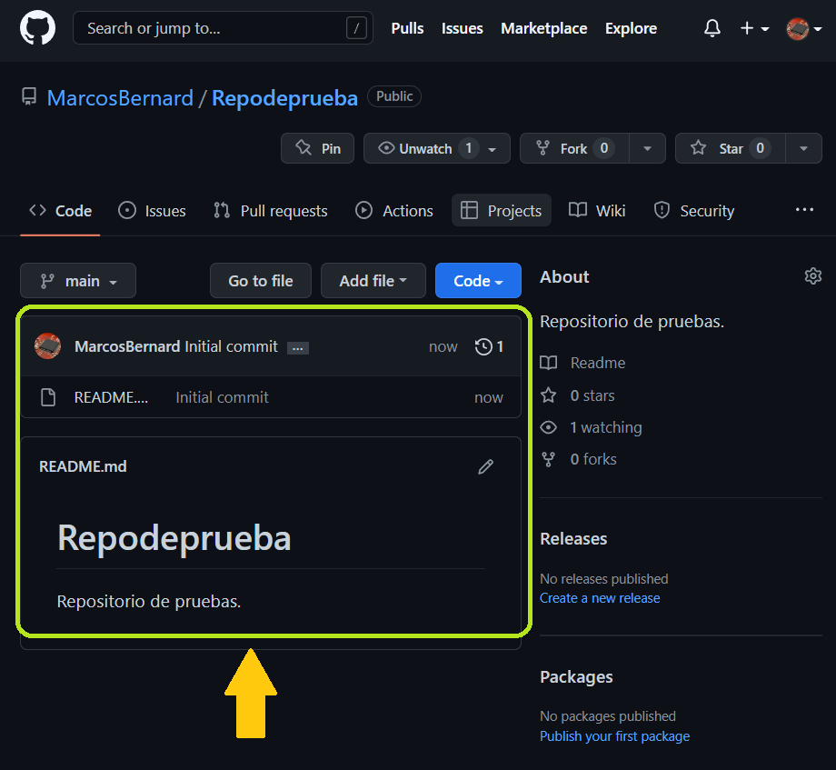

# Crear un repositorio en GitHub
<n>1. </n>
<st>Ir al icono de new <v>(a la izquierda del perfil)</v> y seleccionar "New repository"<st>  

 
<n>2. </n>
<st>Dar un nombre al repositorio y agregar una descripción opcional. 
&nbsp&nbsp&nbsp Luego indicar si el repositorio sera público o privado.<st>  

 
<n>3. </n>
<st>Crear un archivo README <v>(add a README file)</v> para dar una descripción a nuestro repositorio. 
&nbsp&nbsp&nbsp Luego dar click en "Create repository"<st>  

 
<n>4. </n>
<st>Tendremos nuestro nuevo repositorio. <st>  

