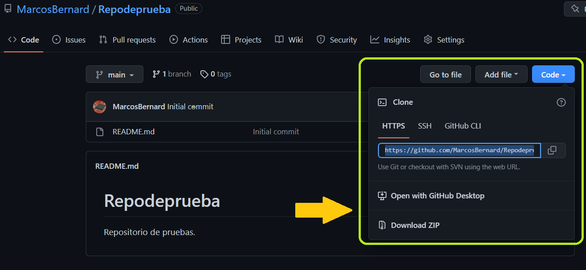
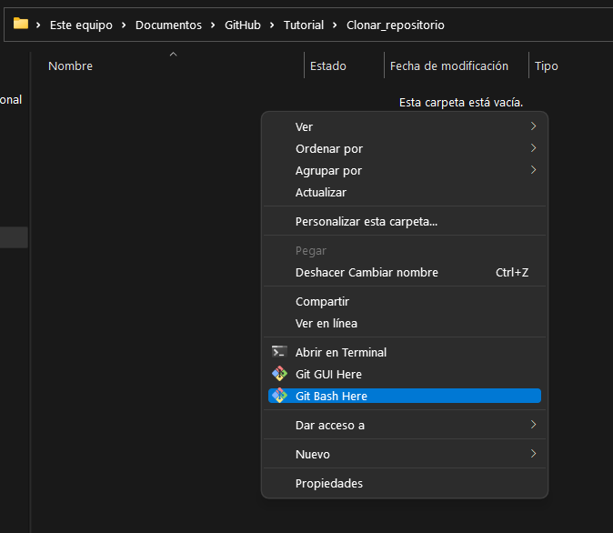
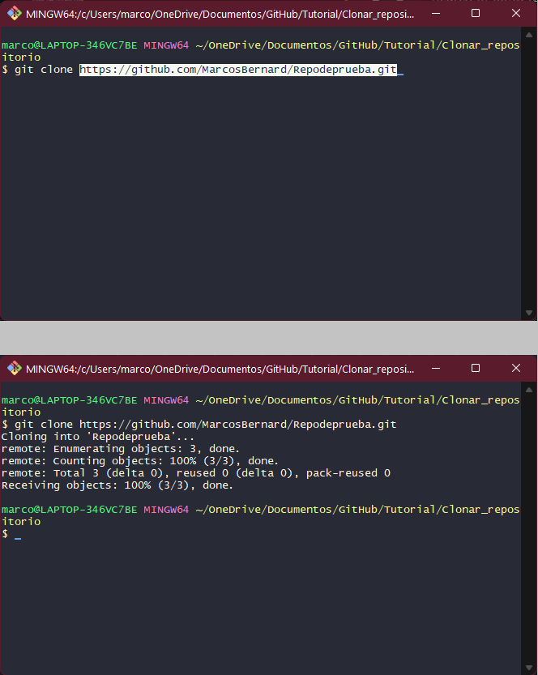
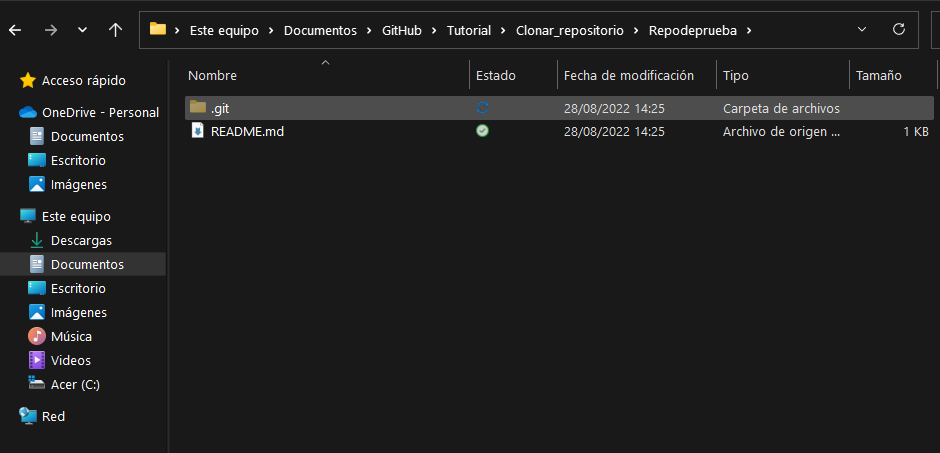

# Clonar un repositorio en GitHub (almacenarlo localmente)

 
<n>1. </n>
<st>Ir al repositorio que deseamos clonar. 
&nbsp&nbsp&nbsp Luego dar click en copia y seleccionar el enlace HTTPS.<st>  

 
<n>2. </n>
<st>Ir a la ruta local donde guardaremos nuestro repositorio. 
&nbsp&nbsp&nbsp Luego dar click derecho y ejecutar "Git Bash"<st>  

 
<n>3. </n>
<st>En la terminal GIT ejecutamos: git clone < ruta del archivo >. 
&nbsp&nbsp&nbsp Luego Verificar si se clono la carpeta.<st>  

 
<n>4. </n>
<st>Tenemos nuestro repositorio clonado. <st>  

