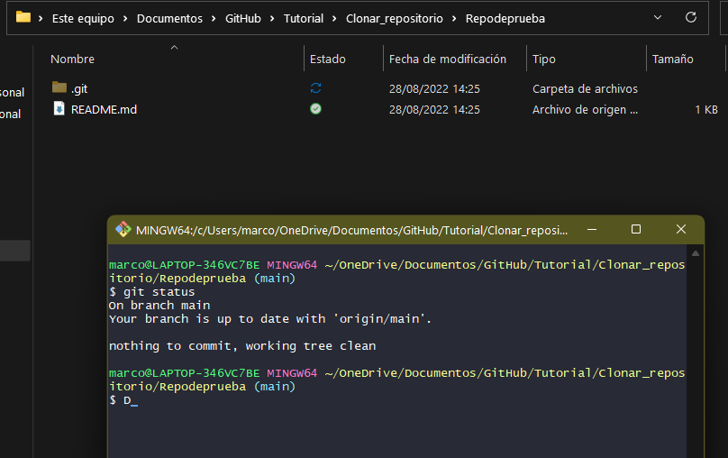
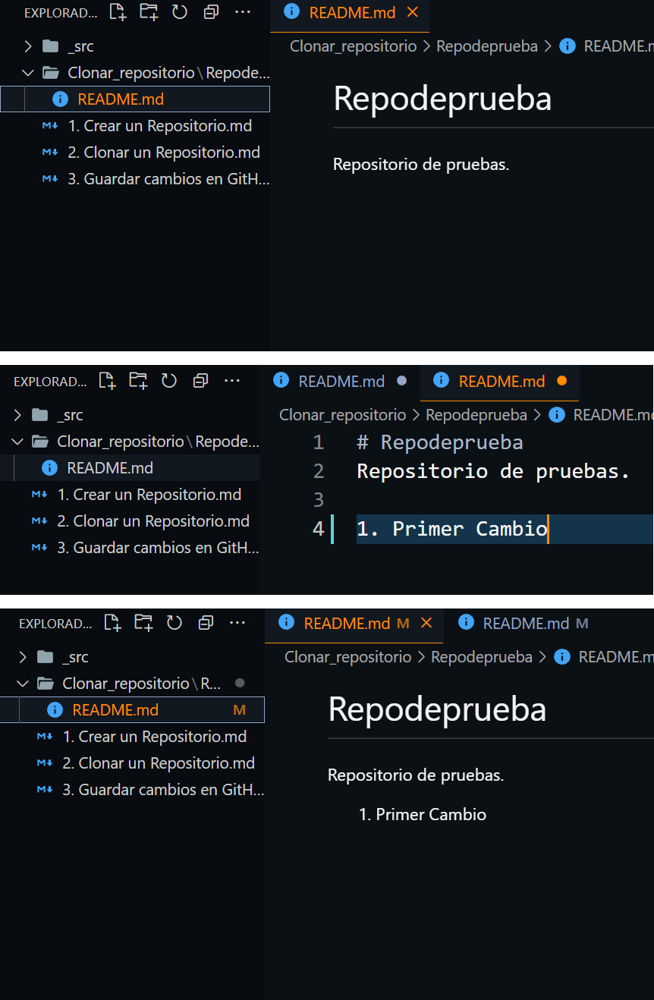
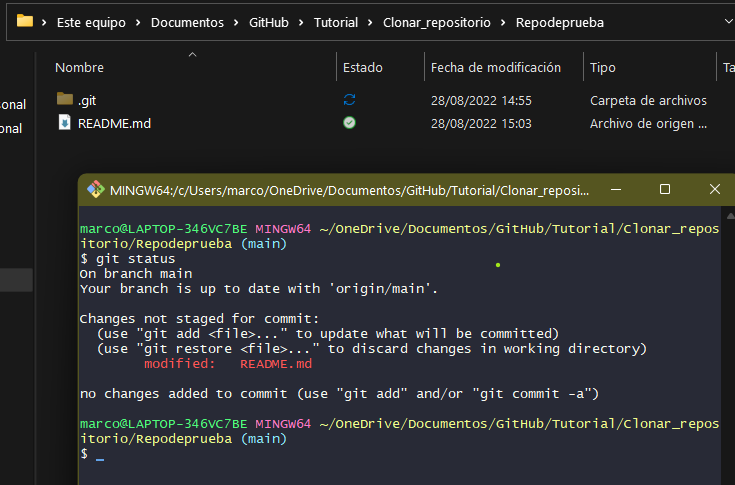
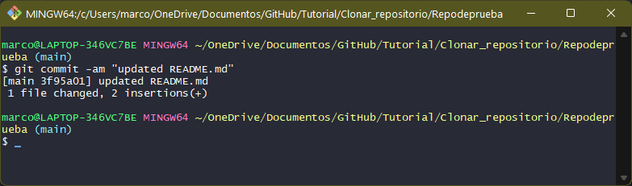
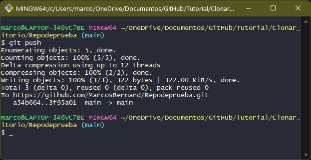
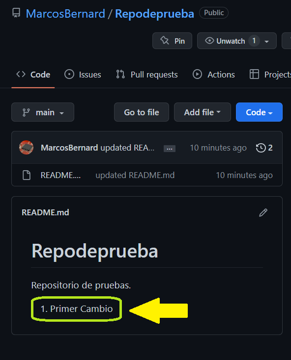

# Editar y actualizar un repositorio
#### Como editar una carpeta clonada y actualizarla en GitHub

<n>1. </n>
<st>Hacer git bash en la carpeta clonada y ejecutar: <g>git status.</g><st>  

 
<n>2. </n>
<st>Editamos nuestro archivo README, y guardamos los cambios localmente.<st>  

 
<n>3. </n>
<st>Verificar si hubo cambios en el archivo con bash. 
&nbsp&nbsp&nbsp Para ello hacemos Git Bash nuevamente en la carpeta y ejecutamos: <g>git status. </g><st>  
 
Confirmamos que hay cambios porque dice: <r> modified:  &nbsp&nbsp README.md</r>

 
<n>4. </n>
<st>Hacemos Git Bash y ejecutamos:  
<g>git commit -am "updated README.md"</g>
 <st> 

 El commit se utiliza para actualizar el repositorio en la ruta local, ahora hay que hacer un push para actualizar el repositorio remoto.

 
<n>5. </n>
<st>Hacemos Git Bash y ejecutamos:  
<g>git push</g>  
<st>

 El push se utiliza para actualizar el repositorio en la ruta remota (de GitHub).

 
<n>5. </n>
<st>Verificamos los cambios en nuestro repositorio. <st>
