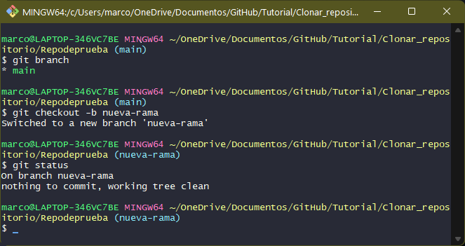
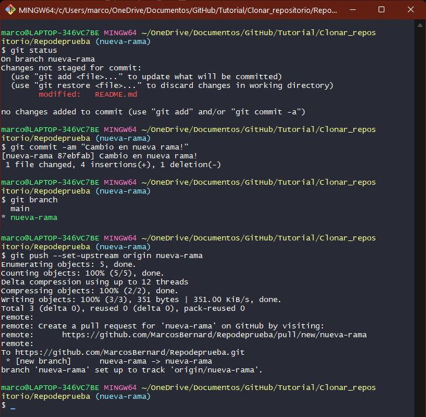
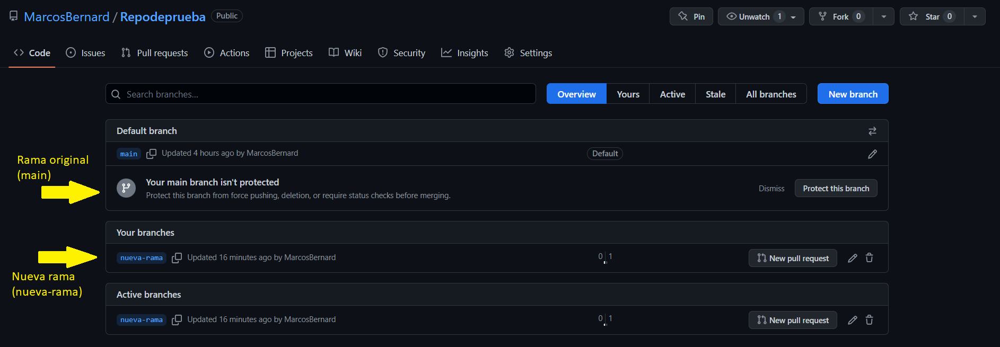

# Guardar repositorio en una rama
#### Como editar una carpeta clonada y guardarla en una rama de GitHub

<n>1. </n>
<st> 
- Hacer git bash en la carpeta clonada y ejecutar:
 &nbsp&nbsp
1) Ver rama actual: <g>git branch</g><st>
 &nbsp&nbsp
2) Cambiar de rama y dar nombre: <g>git checkout -b < nombre_nueva_rama ></g><st>
 &nbsp&nbsp
3) Verificar estado de nuestro archivo: <g>git status</g><st> 
 

<n>2. </n>
<st> 
- Editar nuestro repositorio (README para este ejemplo) y guardarlo en la nueva rama.
 
 &nbsp&nbsp
1) Editar el repositorio (ver paso nº2 de "3. Guardar cambios en GitHub")<st>
 &nbsp&nbsp
2) Verificar estado de nuestro archivo: <g>git branch</g><st>
 &nbsp&nbsp
3) Realizar el commit: <g>git commit -am "Cambio en nueva rama!"</g><st>
 &nbsp&nbsp
4) Verificar la rama donde estamos trabajando: <g>git branch</g><st>
 &nbsp&nbsp
5) Hacer push en la nueva rama: <g>git push --set-upstream origin nueva-rama</g><st>
 &nbsp&nbsp

<n>3. </n>
<st>
- Verificamos la nueva rama en GitHub:</st>
 &nbsp&nbsp

